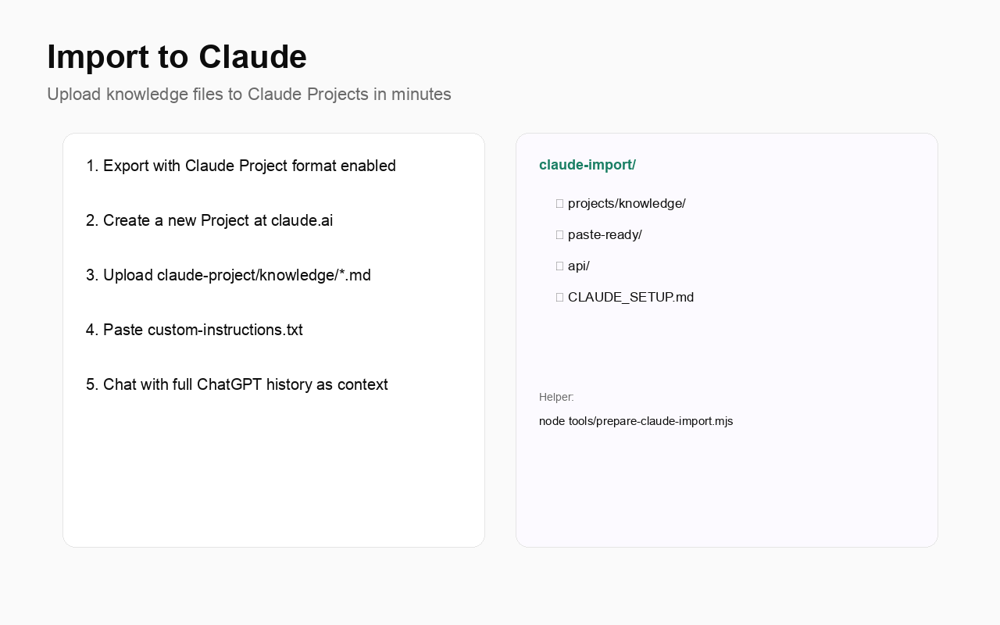
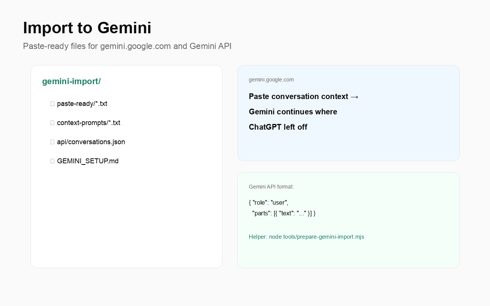

# AI Exporter

**Export ChatGPT → Claude, Gemini & more**

By **[Gaurav Sisodia](https://github.com/sisodiabhumca)**

A browser extension that exports all your **ChatGPT** conversations — including **Enterprise, Team, and Business** accounts — into portable formats you can use with **Claude**, **Gemini**, and other AI tools.

Everything runs locally in your browser. Your chats never leave your machine.


## Features

- Works with **Enterprise / Team / Business** accounts (no built-in export needed)
- Uses your existing ChatGPT session — no API keys required
- Exports **all conversations** with full pagination
- **Single-chat export** via floating button on any conversation page
- **Claude Project** format — upload-ready knowledge files
- **Gemini Import** format — paste-ready for gemini.google.com
- Multiple portable formats in one ZIP download
- Optional image & attachment download
- Incremental export ("new since last export")
- Search/filter by conversation title
- **Chrome, Edge, Brave, and Firefox** support

## Screenshots

| | |
|---|---|
|  |  |
| Single-chat export button | Multiple formats in one ZIP |
|  |  |
| Import to Claude Projects | Import to Google Gemini |

[Full user guide with step-by-step instructions →](docs/USER_GUIDE.md)

## Export formats

| Format | File | Best for |
|--------|------|----------|
| **Universal JSON** | `universal/conversations.json` | Any AI tool, scripts, RAG pipelines |
| **Markdown** | `markdown/*.md` | Copy-paste into Claude, Gemini, etc. |
| **Claude Project** | `claude-project/knowledge/*.md` | Upload directly to Claude Projects |
| **Claude JSON** | `claude/*.json` | Claude API / programmatic use |
| **Gemini Import** | `gemini-import/paste-ready/*.txt` | Paste into gemini.google.com |
| **Gemini JSON** | `gemini/conversations.json` | Google Gemini API |
| **OpenAI JSON** | `openai/conversations.json` | OpenAI API format |
| **Raw JSON** | `raw/*.json` | Full ChatGPT data with metadata |

## Install

### Chrome / Edge / Brave

1. Download or clone this repo
2. Open `chrome://extensions` → enable **Developer mode**
3. Click **Load unpacked** → select the `extension/` folder
4. Pin **AI Exporter** to your toolbar

Or install from Chrome Web Store (once published) — see [PUBLISHING.md](PUBLISHING.md).

### Firefox

1. Open `about:debugging#/runtime/this-firefox`
2. Click **Load Temporary Add-on** → select `extension/manifest.json`

## Usage

1. Go to [chatgpt.com](https://chatgpt.com) and sign in
2. Click the **AI Exporter** icon → choose formats → **Export conversations**
3. Or click **Export chat** on any conversation page

## Import helpers

```bash
# Claude — full package (Projects + paste + API)
node tools/prepare-claude-import.mjs ~/Downloads/chatgpt-export.zip

# Gemini — paste-ready + API
node tools/prepare-gemini-import.mjs ~/Downloads/chatgpt-export.zip

# Claude Projects only
node tools/prepare-claude-project.mjs ~/Downloads/chatgpt-export.zip
```

See [tools/README.md](tools/README.md) and [docs/USER_GUIDE.md](docs/USER_GUIDE.md).

## Enterprise / Team accounts

Automatically detects workspace account ID via `ChatGPT-Account-Id` header. No extra configuration.

## Privacy

All processing in your browser. No external servers, no telemetry. [Privacy Policy](store-listing/privacy-policy.md)

## Author

**Gaurav Sisodia** — [@sisodiabhumca](https://github.com/sisodiabhumca)

## License

MIT
