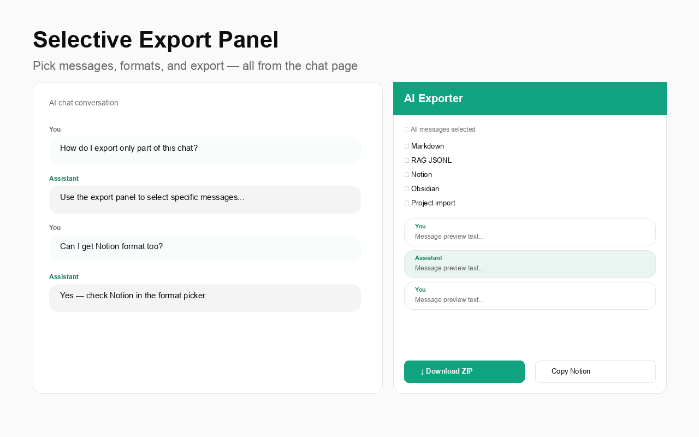

# AI Exporter

**Export from 6 AI platforms → portable formats**

By **[Gaurav Sisodia](https://github.com/sisodiabhumca)**

A browser extension that exports conversations from **ChatGPT**, **Claude**, **Gemini**, **Copilot**, **DeepSeek**, and **Grok** — including **Enterprise, Team, and Business** ChatGPT accounts — into portable formats for **Notion**, **Obsidian**, RAG pipelines, and cross-AI migration.

Everything runs locally in your browser. Your chats never leave your machine.


**Version 1.7.0** — Copilot, DeepSeek, Grok, semantic RAG, merge CLI, scheduled exports.

## What's new in v1.7.0

- **6 platforms** — ChatGPT, Claude, Gemini, Copilot, DeepSeek, Grok
- **Universal merge CLI** — `node tools/ai-exporter.mjs merge export1.zip export2.zip`
- **Semantic RAG chunking** — heading-aware splits for embedding pipelines
- **Scheduled exports** — recurring weekly/daily exports via alarms
- **Audit log CSV** — compliance export includes per-conversation audit trail
- **HTML table of contents** — optional TOC for print/PDF exports

## What's new in v1.5.0

- **Claude.ai export** — export all Claude conversations with thinking blocks and tool calls
- **Gemini export** — export from gemini.google.com via internal API
- **Multi-platform** — one extension for ChatGPT, Claude, and Gemini
- **RAG JSONL** — embedding-ready chunks in `rag/chunks.jsonl`
- **CLI companion** — `node tools/ai-exporter.mjs rag-jsonl export.zip`
- **Compliance v2** — aggregate hash + chain of custody metadata

## v1.4.0 highlights

- **Notion & Obsidian formats** — optimized markdown for your knowledge base
- **HTML bundle** — browse all exported chats in one local `index.html`
- **Group chat support** — speaker labels for multi-user conversations
- **Filename templates** — `{title}`, `{id}`, `{date}`, `{time}` patterns
- **Panel format picker** — choose formats from the in-chat export panel
- **Compliance manifest** — optional SHA-256 hash manifest for audit exports
- **Faster bulk export** — parallel conversation fetch

## Phase 1 features (v1.3.0)

- **In-chat export panel** — select messages, Shift+click ranges, copy or download
- **Rich content** — code blocks, reasoning, citations, web sources preserved
- **CSV export** — spreadsheet-friendly for analysts
- **HTML / PDF** — print-ready HTML, Save as PDF locally (no server)
- **Copy to clipboard** — Markdown or JSON from panel
- **Keyboard shortcut** — `Ctrl+Shift+E` / `⌘⇧E` opens panel
- **Saved preferences** — remembers your format choices

See [roadmap](docs/ROADMAP.md) for Phase 6 plan.

## Supported platforms

| Platform | URL | Bulk export | Selective panel |
|----------|-----|-------------|-------------------|
| ChatGPT | [chatgpt.com](https://chatgpt.com) | ✅ Enterprise/Team | ✅ |
| Claude | [claude.ai](https://claude.ai) | ✅ | ✅ |
| Gemini | [gemini.google.com](https://gemini.google.com) | ✅ | ✅ |
| Copilot | [copilot.microsoft.com](https://copilot.microsoft.com) | ✅ (DOM) | ✅ |
| DeepSeek | [chat.deepseek.com](https://chat.deepseek.com) | ✅ | ✅ |
| Grok | [grok.com](https://grok.com) | ✅ | ✅ |

> **Note:** Copilot export uses DOM scraping and may be restricted in Microsoft Edge. It works in Chrome and Firefox.

## Features

- **Six AI platforms** in one extension — auto-detects the site you're on
- Works with **Enterprise / Team / Business** ChatGPT accounts
- Uses your existing browser session — no API keys required
- Exports **all conversations** with full pagination
- **Single-chat export** via floating button on any conversation page
- **Claude Project** format — upload-ready knowledge files
- **Gemini Import** format — paste-ready for gemini.google.com
- **RAG JSONL** with turn-pair, per-message, or semantic chunking
- **Scheduled exports** — optional daily/weekly/monthly recurring exports
- Multiple portable formats in one ZIP download
- Optional image & attachment download (ChatGPT)
- Incremental export ("new since last export")
- Search/filter by conversation title
- **Chrome, Edge, Brave, and Firefox** support

## Screenshots

### Extension popup

Six platforms, format picker, semantic RAG chunking, and scheduled export options.


### In-chat export

| Floating export button | Selective export panel |
|------------------------|------------------------|
|  |  |
| One-click export on any supported platform | Pick messages, formats, copy or download ZIP |

### Export progress & output

| Real-time progress | ZIP folder structure |
|--------------------|----------------------|
|  |  |
| Live status while conversations download | Universal JSON, RAG JSONL, Notion, compliance, and more |

### Cross-AI migration

| Import to Claude | Import to Gemini |
|------------------|------------------|
|  |  |
| Upload knowledge files to Claude Projects | Paste-ready context for gemini.google.com |

[Full user guide with step-by-step instructions →](docs/USER_GUIDE.md)

## Export formats

| Format | File | Best for |
|--------|------|----------|
| **Universal JSON** | `universal/conversations.json` | Any AI tool, scripts, merge CLI |
| **Markdown** | `markdown/*.md` | Copy-paste into any chat |
| **CSV** | `csv/*.csv` | Spreadsheets, analysts |
| **HTML / PDF** | `html/*.html` | Print → Save as PDF locally (optional TOC) |
| **Notion** | `notion/*.md` | Paste into Notion pages |
| **Obsidian** | `obsidian/*.md` | Obsidian vault with frontmatter |
| **HTML Bundle** | `html-bundle/index.html` | Browse all chats offline |
| **Claude Project** | `claude-project/knowledge/*.md` | Upload directly to Claude Projects |
| **Claude JSON** | `claude/*.json` | Claude API / programmatic use |
| **Gemini Import** | `gemini-import/paste-ready/*.txt` | Paste into gemini.google.com |
| **Gemini JSON** | `gemini/conversations.json` | Google Gemini API |
| **OpenAI JSON** | `openai/conversations.json` | OpenAI API format (ChatGPT) |
| **Raw JSON** | `raw/*.json` | Full platform data with metadata |
| **Compliance** | `compliance/manifest.json` + `audit-log.csv` | SHA-256 audit manifest (optional) |
| **RAG JSONL** | `rag/chunks.jsonl` | Embedding pipelines — turn-pair, message, or semantic |

## Install

### Chrome / Edge / Brave

1. Download or clone this repo
2. Open `chrome://extensions` → enable **Developer mode**
3. Click **Load unpacked** → select the `extension/` folder
4. Pin **AI Exporter** to your toolbar

Or install from Chrome Web Store (once published) — see [PUBLISHING.md](PUBLISHING.md).

### Firefox

1. Open `about:debugging#/runtime/this-firefox`
2. Click **Load Temporary Add-on** → select `extension/manifest.json`

See [Firefox submit checklist](store-listing/FIREFOX-SUBMIT-CHECKLIST.md).

## Usage

1. Open a supported site and sign in:
   - [chatgpt.com](https://chatgpt.com) · [claude.ai](https://claude.ai) · [gemini.google.com](https://gemini.google.com)
   - [copilot.microsoft.com](https://copilot.microsoft.com) · [chat.deepseek.com](https://chat.deepseek.com) · [grok.com](https://grok.com)
2. Click the **AI Exporter** icon → choose formats → **Export conversations**
3. Or click **Export chat** on any conversation page → use the panel for selective export
4. Optionally enable **recurring export** in the popup for scheduled backups

## CLI tools

```bash
# RAG JSONL from any export ZIP
node tools/ai-exporter.mjs rag-jsonl ~/Downloads/chatgpt-export.zip --chunk-size 1500

# Merge exports from multiple platforms into one universal JSON
node tools/ai-exporter.mjs merge chatgpt-export.zip claude-export.zip grok-export.zip

# Or use individual tools
node tools/prepare-rag-jsonl.mjs export.zip --chunk-size 1500 --strategy semantic
```

## Import helpers

```bash
# Claude — full package (Projects + paste + API)
node tools/prepare-claude-import.mjs ~/Downloads/chatgpt-export.zip

# Gemini — paste-ready + API
node tools/prepare-gemini-import.mjs ~/Downloads/chatgpt-export.zip

# Claude Projects only
node tools/prepare-claude-project.mjs ~/Downloads/chatgpt-export.zip
```

See [tools/README.md](tools/README.md) and [docs/USER_GUIDE.md](docs/USER_GUIDE.md).

## Enterprise / Team accounts

Automatically detects workspace account ID via `ChatGPT-Account-Id` header. No extra configuration.

## Privacy

All processing in your browser. No external servers, no telemetry. [Privacy Policy](store-listing/privacy-policy.md)

## Author

**Gaurav Sisodia** — [@sisodiabhumca](https://github.com/sisodiabhumca)  
**Contact:** sisodiabhumca@gmail.com

## License

MIT
