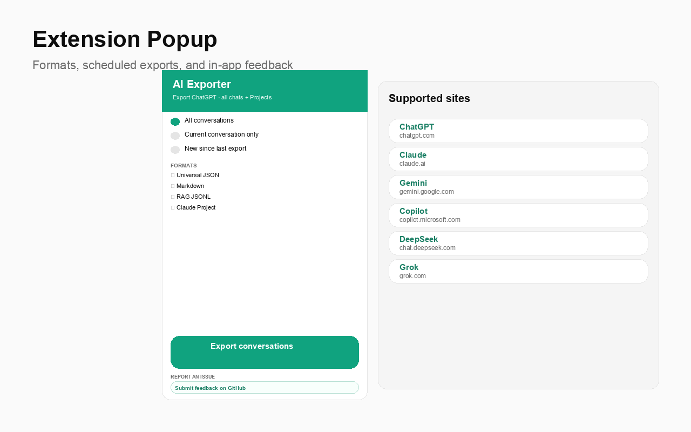
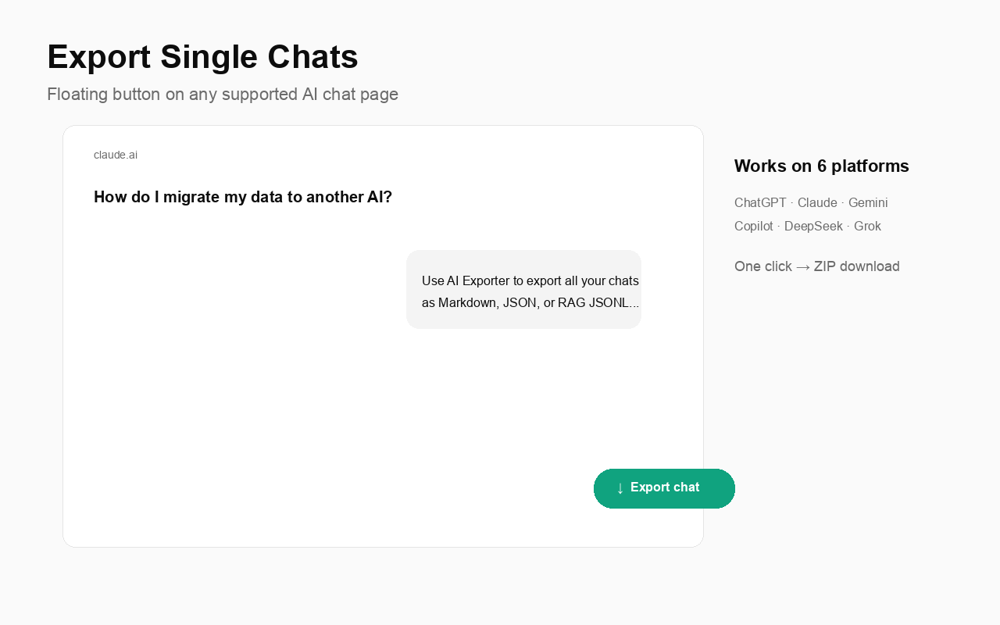
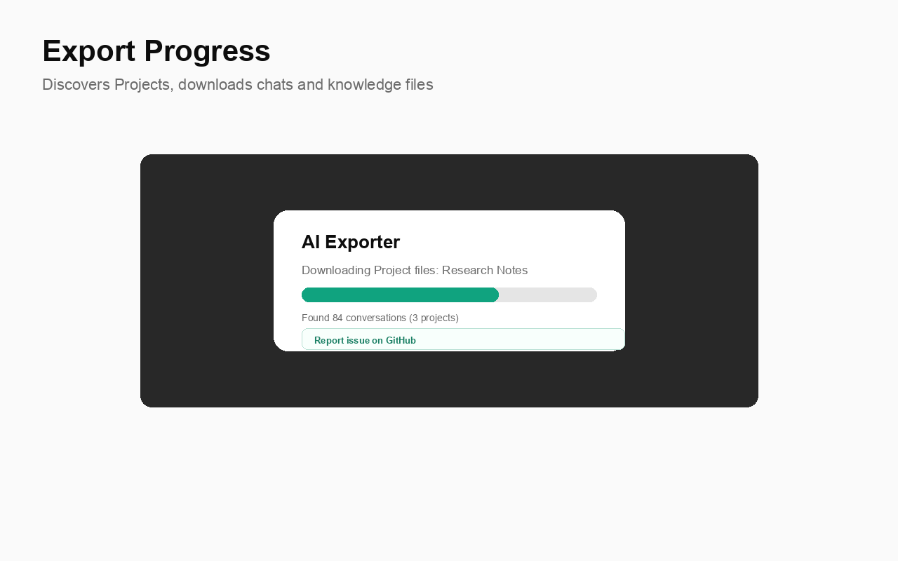
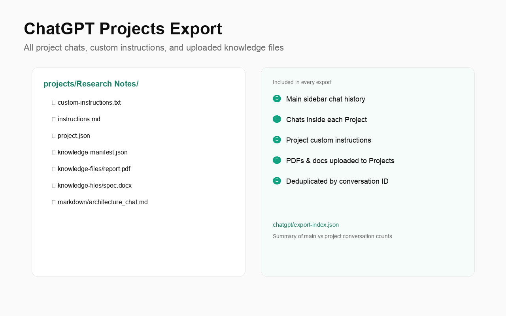
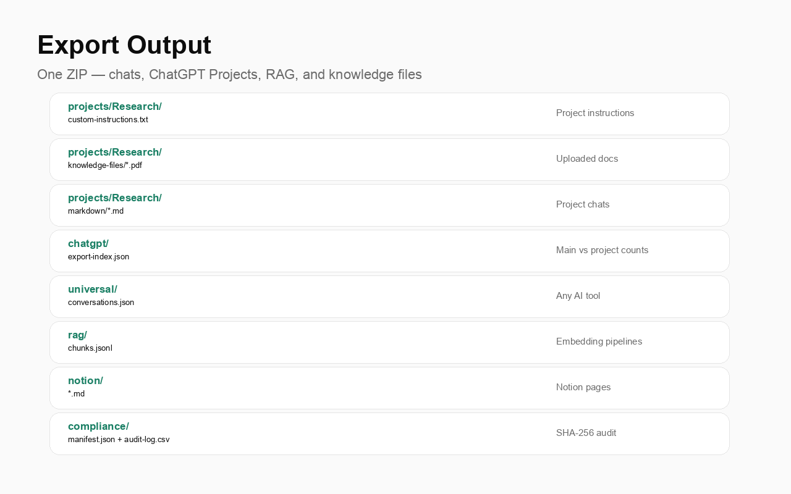
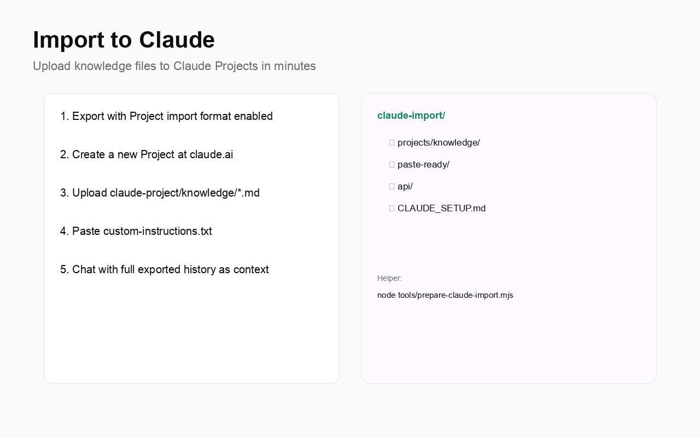
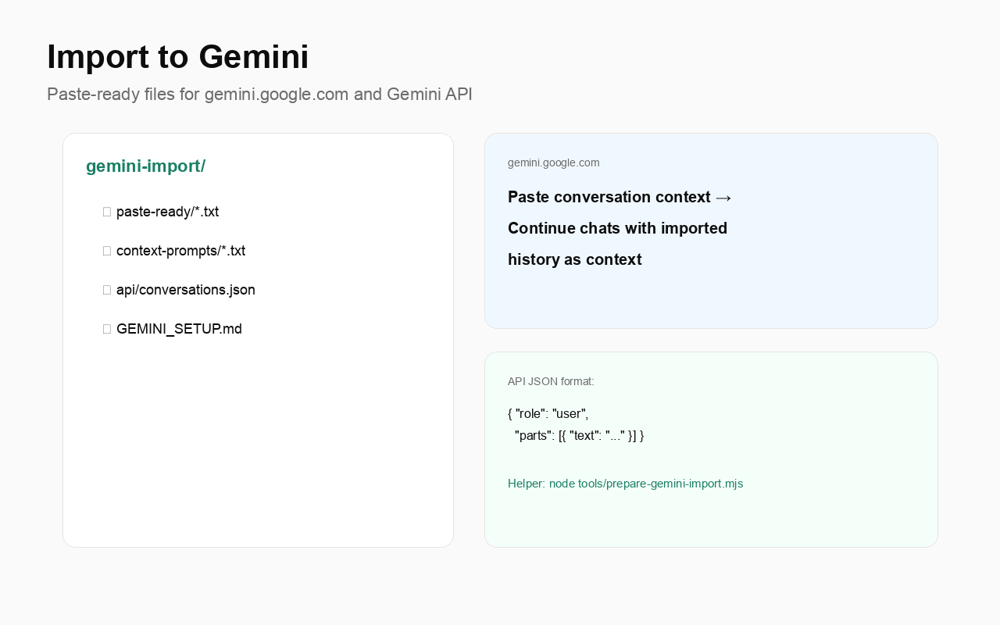

# AI Exporter — User Guide

**Author:** [Gaurav Sisodia](https://github.com/sisodiabhumca)

Export your ChatGPT conversations and import them into Claude, Gemini, or any AI tool.

---

## Quick start



1. **Install** the extension (see [README](../README.md))
2. Go to [chatgpt.com](https://chatgpt.com) and sign in
3. Click the **AI Exporter** icon in your toolbar
4. Select formats and click **Export conversations**
5. Open the downloaded ZIP file

---

## Export a single conversation



When viewing any chat, click the green **Export chat** button in the bottom-right corner. This exports just that conversation — no need to export everything.

---

## Export progress



A progress overlay shows while exporting — including discovering ChatGPT Projects and downloading knowledge files. You can cancel anytime. Large histories may take several minutes.

---

## ChatGPT Projects (full export)



When you export **All conversations** from ChatGPT, the ZIP includes:

- Every chat in your main sidebar history
- Every chat inside each ChatGPT Project (merged and deduplicated)
- **Custom instructions** per Project (`custom-instructions.txt`, `instructions.md`)
- **Uploaded knowledge files** (PDFs, docs) in `projects/{Project Name}/knowledge-files/`
- `chatgpt/export-index.json` — summary counts

Project chats are saved under `projects/{Project Name}/markdown/` (and other formats you select).

---

## What's in the ZIP?



| Folder | Best for |
|--------|----------|
| `projects/{Name}/` | ChatGPT Project chats, instructions, and knowledge files |
| `chatgpt/` | Export index and project knowledge error log |
| `universal/` | Any AI tool — recommended starting point |
| `claude-project/` | Upload directly to Claude Projects |
| `gemini-import/` | Paste into Gemini or use Gemini API |
| `markdown/` | Human-readable, great for copy-paste |
| `claude/` | Claude API / JSON format |
| `raw/` | Full original ChatGPT data |

Each export includes `IMPORT_GUIDE.md` with detailed instructions.

---

## Import into Claude



### Option A — Claude Projects (recommended)

Best when you want Claude to reference your full ChatGPT history across many chats.

1. Export with **Claude Project** format enabled (default)
2. Go to [claude.ai](https://claude.ai) → **Projects** → **New Project**
3. Upload all files from `claude-project/knowledge/`
4. Paste `claude-project/custom-instructions.txt` into **Project instructions**
5. Start chatting

### Option B — Copy-paste one chat

1. Open any file in `markdown/`
2. Copy the contents
3. Paste into a new Claude chat

### Option C — Import helper (full package)

Rebuild a complete Claude import folder from any export:

```bash
node tools/prepare-claude-import.mjs ~/Downloads/chatgpt-export-2025-06-25.zip
```

Creates `claude-import/` with:
- `projects/knowledge/` — Claude Projects upload
- `paste-ready/` — one file per chat to paste
- `api/` — JSON for Claude API
- `CLAUDE_SETUP.md` — step-by-step guide

---

## Import into Gemini



Enable **Gemini JSON** or **Gemini Import (paste-ready)** in the export popup (both are on by default). Your ZIP will include:

```
gemini-import/
├── paste-ready/          ← Option A
├── context-prompts/      ← Option B
├── api/                  ← Option C (per-chat + conversations.json)
├── manifest.json
└── GEMINI_SETUP.md
```

### Option A — Copy-paste (easiest)

1. Open any file in `gemini-import/paste-ready/`
2. Go to [gemini.google.com](https://gemini.google.com)
3. Paste into a new chat
4. Gemini uses your ChatGPT history as context

### Option B — Context prompts (long chats)

Files in `gemini-import/context-prompts/` include framing instructions plus full history — better for long conversations.

### Option C — Gemini API

Use `gemini-import/api/conversations.json` with the Google AI SDK:

```javascript
import { GoogleGenerativeAI } from "@google/generative-ai";

const genAI = new GoogleGenerativeAI(process.env.GEMINI_API_KEY);
const model = genAI.getGenerativeModel({ model: "gemini-2.0-flash" });

// Each conversation has turns: [{ role: "user"|"model", parts: [{ text }] }]
```

### Option D — Import helper

```bash
node tools/prepare-gemini-import.mjs ~/Downloads/chatgpt-export-2025-06-25.zip
```

Creates `gemini-import/` with paste-ready files, context prompts, and API JSON.

---

## Enterprise / Team accounts

AI Exporter automatically detects your workspace and includes the required `ChatGPT-Account-Id` header. No configuration needed — just sign in to your Enterprise account on chatgpt.com and export.

---

## Command-line import helpers

| Command | Output | Use case |
|---------|--------|----------|
| `node tools/prepare-claude-import.mjs <export>` | `claude-import/` | Full Claude package |
| `node tools/prepare-claude-project.mjs <export>` | `claude-project-upload/` | Claude Projects only |
| `node tools/prepare-gemini-import.mjs <export>` | `gemini-import/` | Full Gemini package |

All helpers accept a ZIP file or extracted folder:

```bash
node tools/prepare-claude-import.mjs ./chatgpt-export-2025-06-25.zip --out ./my-claude-import
```

---

## Privacy

- All processing happens in your browser
- No data is sent to external servers
- No analytics or tracking
- See [Privacy Policy](../store-listing/privacy-policy.md)

---

## Troubleshooting

| Problem | Solution |
|---------|----------|
| Extension says "Open chatgpt.com" | Navigate to chatgpt.com and sign in |
| "Could not connect" | Refresh the ChatGPT tab |
| Export button not visible | Make sure you're viewing a conversation (`/c/...` URL) |
| Missing chats | Confirm you're on the correct workspace account |
| Slow export | Disable "Download images & attachments" |

---

## Links

- **GitHub:** [github.com/sisodiabhumca/ai-exporter](https://github.com/sisodiabhumca/ai-exporter)
- **Author:** [Gaurav Sisodia](https://github.com/sisodiabhumca)
- **Publishing guide:** [PUBLISHING.md](../PUBLISHING.md)
